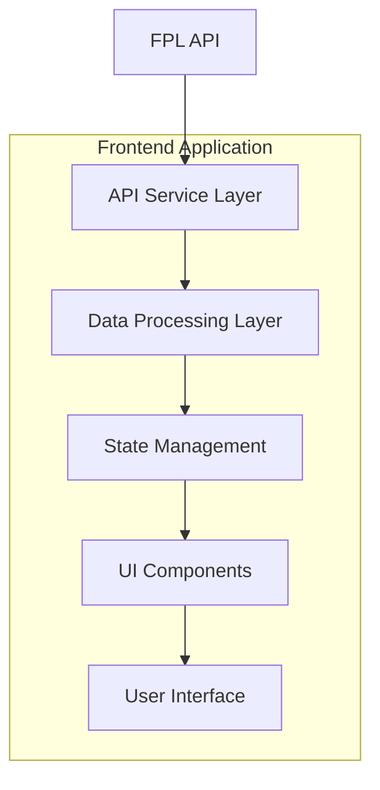

# Design Document

## Overview

The FPL Fixture Difficulty Table is a web application component that displays upcoming Premier League fixtures with difficulty ratings to help Fantasy Premier League managers make informed decisions. The system will consume data from the official FPL API and present it in an interactive, sortable table format with visual difficulty indicators.

## Architecture

### High-Level Architecture



### Technology Stack
- **Frontend Framework**: React with TypeScript
- **State Management**: React Context API or Zustand for lightweight state management
- **Styling**: CSS Modules or Styled Components with responsive design
- **HTTP Client**: Axios or Fetch API for API communication
- **Build Tool**: Vite or Create React App

### Data Flow
1. User interacts with controls (gameweek slider, team search, sorting)
2. State management updates application state
3. Data processing layer filters and transforms fixture data
4. UI components re-render with updated data
5. Visual indicators update based on difficulty ratings

## Components and Interfaces

### Core Components

#### 1. FixtureDifficultyTable (Main Container)
```typescript
interface FixtureDifficultyTableProps {
  initialGameweeks?: number;
  defaultSortBy?: 'team' | 'difficulty';
}
```

**Responsibilities:**
- Orchestrates all child components
- Manages global state and API calls
- Handles error states and loading indicators

#### 2. GameweekSlider
```typescript
interface GameweekSliderProps {
  value: number;
  min: number;
  max: number;
  onChange: (value: number) => void;
}
```

**Responsibilities:**
- Renders horizontal slider control
- Provides real-time value feedback
- Triggers table updates on value change

#### 3. TeamSearchFilter
```typescript
interface TeamSearchFilterProps {
  searchTerm: string;
  onSearchChange: (term: string) => void;
  placeholder?: string;
}
```

**Responsibilities:**
- Provides search input field
- Handles real-time filtering
- Shows search results count

#### 4. FixtureTable
```typescript
interface FixtureTableProps {
  teams: TeamFixture[];
  gameweeks: number;
  sortBy: SortOption;
  onSortChange: (sort: SortOption) => void;
}
```

**Responsibilities:**
- Renders the main data table
- Handles column sorting
- Displays fixture cells with difficulty colors

#### 5. FixtureCell
```typescript
interface FixtureCellProps {
  fixture: Fixture;
  isHome: boolean;
  difficulty: number;
}
```

**Responsibilities:**
- Displays individual fixture information
- Applies difficulty-based color coding
- Shows opponent and venue indicators

#### 6. DifficultyLegend
```typescript
interface DifficultyLegendProps {
  showLegend: boolean;
}
```

**Responsibilities:**
- Displays color coding explanation
- Shows difficulty scale (1-5)
- Provides user guidance

### API Service Layer

#### FPLApiService
```typescript
class FPLApiService {
  async getFixtures(): Promise<FixtureResponse>;
  async getTeams(): Promise<TeamResponse>;
  async getGameweeks(): Promise<GameweekResponse>;
  private handleApiError(error: any): void;
}
```

**Responsibilities:**
- Manages all FPL API communications
- Handles authentication if required
- Implements error handling and retry logic
- Caches responses for performance

## Data Models

### Core Data Types

```typescript
interface Team {
  id: number;
  name: string;
  short_name: string;
  code: number;
  strength: number;
  strength_overall_home: number;
  strength_overall_away: number;
  strength_attack_home: number;
  strength_attack_away: number;
  strength_defence_home: number;
  strength_defence_away: number;
}

interface Fixture {
  id: number;
  code: number;
  event: number; // gameweek
  finished: boolean;
  kickoff_time: string;
  team_a: number; // away team id
  team_h: number; // home team id
  team_a_score?: number;
  team_h_score?: number;
  team_a_difficulty: number; // 1-5 difficulty rating
  team_h_difficulty: number; // 1-5 difficulty rating
}

interface Gameweek {
  id: number;
  name: string;
  deadline_time: string;
  finished: boolean;
  is_current: boolean;
  is_next: boolean;
}

interface TeamFixture {
  team: Team;
  fixtures: ProcessedFixture[];
  averageDifficulty: number;
}

interface ProcessedFixture {
  opponent: Team;
  isHome: boolean;
  difficulty: number;
  gameweek: number;
  kickoffTime: string;
}
```

### State Management

```typescript
interface AppState {
  teams: Team[];
  fixtures: Fixture[];
  gameweeks: Gameweek[];
  filteredTeams: TeamFixture[];
  selectedGameweeks: number;
  searchTerm: string;
  sortBy: SortOption;
  sortDirection: 'asc' | 'desc';
  loading: boolean;
  error: string | null;
}

type SortOption = 'team' | 'difficulty' | 'alphabetical';
```

## Error Handling

### Error Types and Responses

1. **API Connection Errors**
   - Display: "Unable to connect to FPL servers. Please try again later."
   - Action: Provide retry button, cache last successful data

2. **Data Parsing Errors**
   - Display: "Error processing fixture data. Some information may be incomplete."
   - Action: Show partial data where possible, log errors

3. **Network Timeouts**
   - Display: Loading spinner with timeout message after 10 seconds
   - Action: Automatic retry with exponential backoff

4. **Invalid Gameweek Selection**
   - Display: Inline validation message
   - Action: Reset to valid range, highlight constraints

### Error Recovery Strategies

- **Graceful Degradation**: Show cached data when API is unavailable
- **Progressive Loading**: Load teams first, then fixtures incrementally
- **Retry Logic**: Implement exponential backoff for failed requests
- **User Feedback**: Clear error messages with actionable next steps

## Testing Strategy

### Unit Testing
- **Component Testing**: Test each React component in isolation
- **Service Testing**: Mock API responses and test data processing
- **Utility Testing**: Test sorting, filtering, and calculation functions
- **State Management**: Test state updates and side effects

### Integration Testing
- **API Integration**: Test actual FPL API responses and error handling
- **Component Integration**: Test component interactions and data flow
- **User Workflows**: Test complete user journeys (search, sort, filter)

### End-to-End Testing
- **Critical Paths**: Test main user scenarios across different devices
- **Performance**: Test loading times and responsiveness
- **Accessibility**: Test keyboard navigation and screen reader compatibility

### Test Data Strategy
- **Mock Data**: Create realistic fixture and team data for development
- **API Mocking**: Use tools like MSW for consistent API responses
- **Edge Cases**: Test with empty data, single team, maximum gameweeks

### Performance Considerations

1. **Data Optimization**
   - Cache API responses for 5-10 minutes
   - Implement virtual scrolling for large datasets
   - Lazy load fixture details on demand

2. **Rendering Optimization**
   - Use React.memo for expensive components
   - Implement debounced search to reduce re-renders
   - Optimize table rendering with fixed heights

3. **Bundle Optimization**
   - Code splitting for non-critical components
   - Tree shaking for unused utilities
   - Optimize images and icons

### Responsive Design Strategy

1. **Breakpoints**
   - Mobile: < 768px (stacked layout, essential info only)
   - Tablet: 768px - 1024px (condensed table)
   - Desktop: > 1024px (full table with all features)

2. **Mobile Adaptations**
   - Horizontal scrolling for fixture columns
   - Collapsible team rows for detailed view
   - Touch-friendly slider and search controls
   - Simplified color coding with larger touch targets

3. **Accessibility Features**
   - ARIA labels for difficulty ratings
   - Keyboard navigation for all interactive elements
   - High contrast mode support
   - Screen reader announcements for dynamic updates